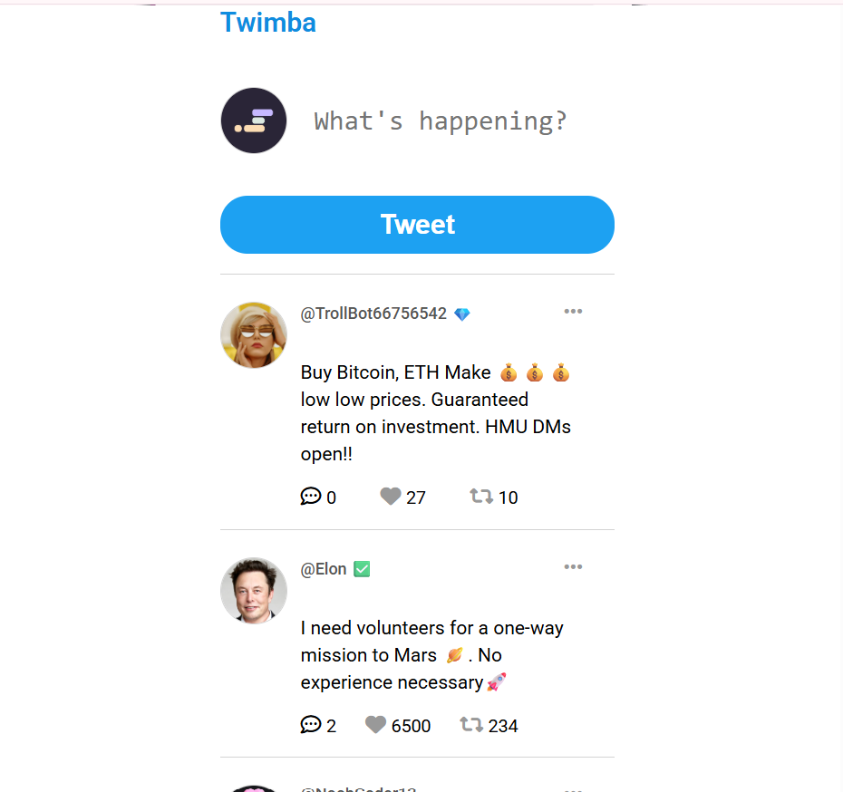

# Twimba - Using  basic twitter functionality

## Table of contents

- [Overview](#overview)
  - [The challenge](#the-challenge)
  - [Screenshot](#screenshot)
  - [Links](#links)
- [My process](#my-process)
  - [Built with](#built-with)
  - [What I learned](#what-i-learned)
  - [Continued development](#continued-development)
- [Author](#author)
- [Acknowledgments](#acknowledgments)

**Note: Delete this note and update the table of contents based on what sections you keep.**

## Overview

### The challenge

Users should be able to:

- View the optimal layout depending on their device's screen size
- See hover and focus states for interactive elements
- tweet and share whats on their mind
- reply to tweets
- like and retweet
- delete tweet

### Screenshot

### Links

- Solution URL: (https://github.com/vault-codes/twitter-clone/)

- Live Site URL:  https://twimba-prime.netlify.app/

## My process

### Built with

- Semantic HTML5 markup
- CSS custom properties
- javascript object concept.
- javascript array method.
- uuid (universal unique identifier)
- State Driven Ui to render objects state using object data(source of truth)
- Local storage to store data

### What I learned

i learned how to implement javascript object rendering using html tags. then i also learned how to link uuid property  to an individual object element. i also learned State Driven Ui, using  Array data to loop through and  build  each Html object  and render out to screen.

### Continued development

i will try focusing on understanding  how to also do more use cases of  State Driven UI flow concept

## Author

- Website -
- https://twimba-prime.netlify.app/

